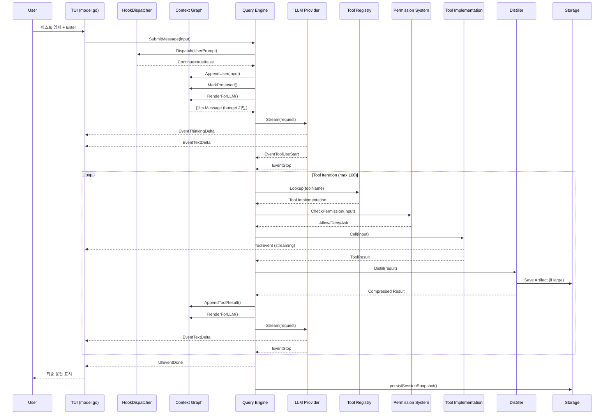
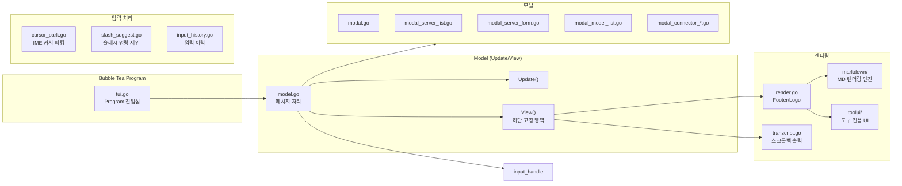
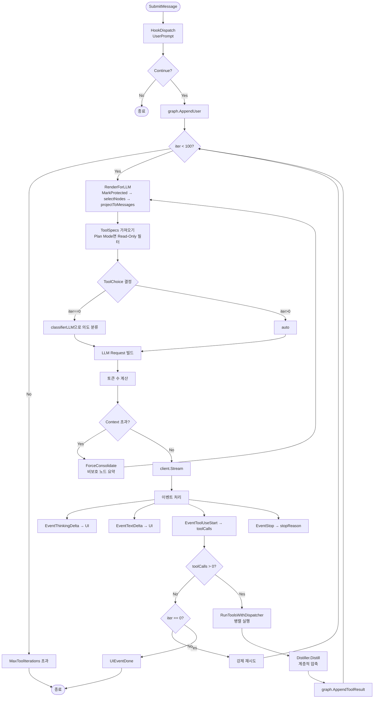
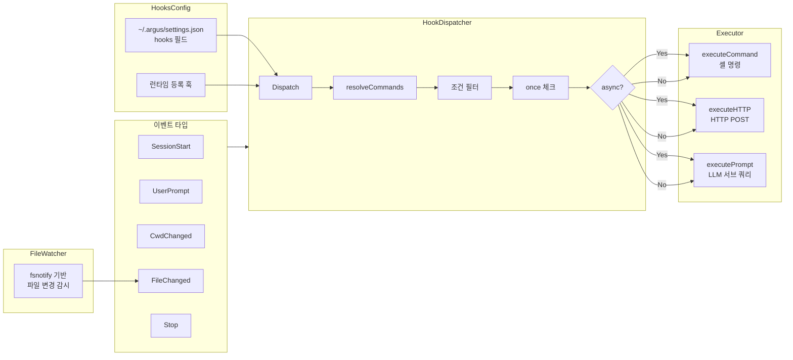
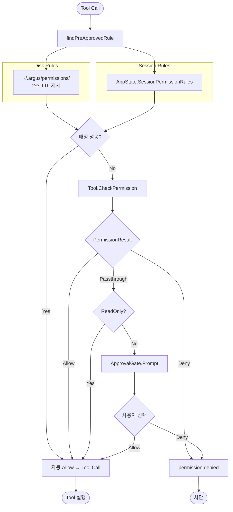

# Argus 전체 아키텍처 다이어그램

## 1. 시스템 전체 개요 (High-Level Architecture)

```mermaid
graph TB
    subgraph User["👤 사용자 (Terminal)"]
        UI["TUI Interaction"]
    end

    subgraph CLI_Entry["📥 CLI Entry Point"]
        main["cmd/argus/main.go"]
        init["init.go / init_menu.go"]
        version["version.go"]
    end

    subgraph TUI_Layer["🖥️ TUI Layer (Bubble Tea)"]
        tui["internal/tui/tui.go"]
        model["internal/tui/model.go"]
        render["internal/tui/render.go"]
        transcript["internal/tui/transcript.go"]
        cursor["internal/tui/cursor_park.go"]
        markdown["internal/tui/markdown/"]
        toolui["internal/tui/toolui/"]
        theme["internal/tui/theme.go"]
        modal["internal/tui/modal.go"]
    end

    subgraph Query_Engine["⚙️ Query Engine (Core Heart)"]
        engine["internal/query/engine.go"]
        config["internal/query/config.go"]
        stophooks["internal/query/stop_hooks.go"]
    end

    subgraph Context["🧠 Context Management"]
        graph["internal/context/graph.go"]
        estimator["internal/context/token_estimator.go"]
        distiller["internal/context/distiller.go"]
        artifact["internal/context/artifact_store.go"]
    end

    subgraph Tool_System["🔧 Tool System"]
        registry["internal/skills/registry.go"]
        tool_base["internal/tools/tool.go"]
        filetools["fileread / filewrite / fslist / grep"]
        shelltools["bash / powershell / shelljob"]
        webtools["webfetch / websearch"]
        plantools["todowrite / enterplanmode / exitplanmode"]
        mcptools["mcptool / lsptool / mcpauth"]
        servertools["serverconnect / servertunnel"]
    end

    subgraph Hooks["🪝 Hook System"]
        dispatcher["internal/hooks/dispatcher.go"]
        executor["internal/hooks/executor.go"]
        matcher["internal/hooks/matcher.go"]
        watcher["internal/hooks/watcher.go"]
    end

    subgraph State["💾 State Management"]
        appstate["internal/state/app_state.go"]
        modelstate["internal/state/model_state.go"]
        sessionstate["internal/state/session_state.go"]
        permstate["internal/state/permission_state.go"]
        todostate["internal/state/todo_state.go"]
        workflowstate["internal/state/workflow_state.go"]
    end

    subgraph LLM["🤖 LLM Providers"]
        llm_iface["internal/services/llm/llm.go"]
        anthropic["internal/services/llm/anthropic.go"]
        gemini["internal/services/llm/gemini.go"]
        openai["internal/services/llm/openai.go"]
        registry_llm["internal/services/llm/registry.go"]
        retry["internal/services/llm/retry.go"]
        toolcalls["internal/services/llm/toolcalls.go"]
    end

    subgraph MCP["🔌 MCP Integration"]
        mcp_mgr["internal/services/mcp/manager.go"]
        bridge["BridgeTool Pattern"]
    end

    subgraph Security["🔒 Security"]
        perm_rules["internal/utils/permissions/"]
        dpapi["internal/security/dpapi.go"]
        pathguard["internal/tools/path_guard.go"]
        shellval["internal/tools/shell_validation.go"]
    end

    subgraph Utils["🛠️ Utilities"]
        bash["internal/utils/bash/"]
        pshell["internal/utils/powershell/"]
        shell["internal/utils/shell.go"]
        sandbox["internal/utils/sandbox/"]
        ultraplan["internal/utils/ultraplan/"]
    end

    subgraph ShellJobs["⏳ Shell Jobs"]
        jobs_mgr["internal/shelljobs/manager.go"]
    end

    subgraph Storage["💿 Persistent Storage"]
        sessions["~/.argus/sessions/*.ndjson"]
        mcp_json["~/.argus/mcp.json"]
        models_json["~/.argus/models.json"]
        settings_json["~/.argus/settings.json"]
        permissions["~/.argus/permissions/"]
        artifacts["~/.argus/session-artifacts/"]
    end

    User --> TUI_Layer
    CLI_Entry --> TUI_Layer
    TUI_Layer --> Query_Engine
    Query_Engine --> Context
    Query_Engine --> Tool_System
    Query_Engine --> Hooks
    Query_Engine --> State
    Query_Engine --> LLM
    Tool_System --> MCP
    Query_Engine --> Security
    Tool_System --> Utils
    Query_Engine --> ShellJobs
    Context --> Storage
    State --> Storage
    Hooks --> Utils
```

---

## 2. 데이터 흐름 (End-to-End Data Flow)



---

## 3. TUI 계층 구조



---

## 4. 쿼리 엔진 실행 루프



---

## 5. Context Graph 구조

```mermaid
graph TD
    subgraph Graph["Graph Structure"]
        G[Graph<br/>nodes, seq]
    end

    subgraph Nodes["Node Types"]
        User[User Node<br/>사용자 메시지]
        Assistant[Assistant Node<br/>어시스턴트 응답]
        Thinking[Thinking Node<br/>추론 과정]
        ToolUse[ToolUse Node<br/>도구 호출]
        ToolResult[ToolResult Node<br/>도구 결과]
        Summary[Summary Node<br/>합성 요약]
        ArtifactRef[ArtifactRef Node<br/>파일 참조]
    end

    subgraph Operations["Graph Operations"]
        AppendOps[AppendUser / AppendAssistant / AppendToolUse / AppendToolResult]
        Protect[MarkProtected<br/>최신 2턴 + tool 쌍 보호]
        Select[selectNodes<br/>budget 기반 노드 선택]
        Project[projectToMessages<br/>[]llm.Message 변환]
    end

    subgraph Distiller["Distiller (계층적 압축)"]
        Full[Full<br/>≤8,000 chars → inline]
        Partial[Partial<br/>8~20K → head+tail]
        SummaryLevel[Summary<br/>20K+ → LLM 요약]
        Extractive[Extractive<br/>요약 실패 → head 5 + tail 5]
    end

    subgraph ArtifactStore["Artifact Store"]
        Save[원본 파일 저장<br/>session-artifacts/]
        Ref[Graph에는 ID/Path만 참조]
    end

    G --> Nodes
    G --> Operations
    Operations --> Distiller
    Distiller --> ArtifactStore
```

---

## 6. Tool 시스템 아키텍처

```mermaid
graph TB
    subgraph Registry["Tool Registry"]
        R[Registry<br/>tools map, source map, alias map]
        Methods[Register / RegisterFromMCP / RegisterAlias / Lookup / ToolSpecs / Unregister]
    end

    subgraph BuiltIn["내장 Tool 23개"]
        Shell["셸 도구<br/>bash, powershell, shelljob, shelljobcontrol"]
        File["파일/FS<br/>fileread, filewrite, fslist, glob, grep"]
        Web["웹<br/>webfetch, websearch"]
        Plan["계획/관리<br/>todowrite, todoread, task, enterplanmode, exitplanmode"]
        Ext["외부 통합<br/>mcptool, lsptool, listmcpresources, readmcpresource, mcpauth"]
        Server["서버 관리<br/>serverconnect, servercopy, serverinspect, servermetrics, servertunnel"]
        Other["기타<br/>skilltool, sniptool, askuser, enterworktree, exitworktree"]
    end

    subgraph MCP_Bridge["MCP Dynamic Bridge"]
        MCP_Config["mcp.json 설정"]
        MCP_Manager["mcp.Manager.Load"]
        BridgeTool["BridgeTool 생성<br/>mcp__{server}__{tool_name}"]
    end

    subgraph Tool_Interface["Tool Interface"]
        Name[Name()]
        Desc[Description()]
        Schema[InputSchema()]
        ReadOnly[IsReadOnly()]
        Call[Call → chan ToolEvent]
        Perm[CheckPermission]
        MaxSize[MaxResultSizeChars()]
    end

    subgraph Tool_Renderer["Tool Renderer"]
        TR[ToolRenderer Interface]
        Interactive[InteractiveModel<br/>SSH 비밀번호, ask_user 등]
        WebFetchUI[WebFetch UI]
        WebSearchUI[WebSearch UI]
        Specialized[Specialized Renderers]
    end

    R --> Methods
    Methods --> BuiltIn
    MCP_Config --> MCP_Manager --> BridgeTool
    BridgeTool --> R
    BuiltIn --> Tool_Interface
    Tool_Interface --> Tool_Renderer
```

---

## 7. Hook 시스템



---

## 8. LLM Provider 계층

```mermaid
graph TB
    subgraph LLM_Interface["LLM Interface"]
        Stream[Stream → chan Event]
        CountTokens[CountTokens]
        Capabilities[Capabilities]
        Provider[Provider]
    end

    subgraph Anthropic["Anthropic Provider"]
        A_API[POST /messages]
        A_Discovery[GET /models]
        A_Tool[tool_use / tool_result]
        A_Thinking[extended_thinking]
    end

    subgraph Gemini["Gemini Provider"]
        G_API[POST /models/{model}:streamGenerateContent]
        G_Discovery[GET /models]
        G_Tool[functionCall / functionResponse]
    end

    subgraph OpenAI["OpenAI-compat Provider"]
        O_API[POST /chat/completions]
        O_Discovery[GET /models]
        O_Tool[function_call / tool_calls]
        O_URL[URL 자동 정규화]
    end

    subgraph Registry["Model Registry"]
        ModelsJSON[~/.argus/models.json]
        Preset[기본 프리셋<br/>Claude, Gemini, GPT]
        Custom[사용자 커스텀 모델]
    end

    subgraph Conversion["Tool Call 변환 레이어"]
        TC[toolcalls.go<br/>공급자별 포맷 → 내부 표준]
    end

    subgraph Retry["Retry 정책"]
        R[retry.go<br/>Exponential backoff<br/>5xx, 429 대상]
    end

    LLM_Interface --> Anthropic
    LLM_Interface --> Gemini
    LLM_Interface --> OpenAI
    Registry --> LLM_Interface
    Anthropic --> Conversion
    Gemini --> Conversion
    OpenAI --> Conversion
    LLM_Interface --> Retry
```

---

## 9. 권한 시스템



---

## 10. 패키지 구조 요약

| 패키지 | 역할 | 주요 파일 |
|--------|------|-----------|
| `cmd/argus/` | CLI 진입점, 초기화, 버전 | [`main.go`](C:/Dev/Argus/cmd/argus/main.go), [`init.go`](C:/Dev/Argus/cmd/argus/init.go) |
| `internal/tui/` | Bubble Tea 기반 TUI 엔진 | [`tui.go`](C:/Dev/Argus/internal/tui/tui.go), [`model.go`](C:/Dev/Argus/internal/tui/model.go) |
| `internal/tui/markdown/` | Markdown 렌더링 | [`markdown.go`](C:/Dev/Argus/internal/tui/markdown/markdown.go) |
| `internal/tui/toolui/` | 도구 전용 UI 렌더러 | [`renderer.go`](C:/Dev/Argus/internal/tui/toolui/renderer.go) |
| `internal/query/` | 쿼리 엔진 (핵심 심장) | [`engine.go`](C:/Dev/Argus/internal/query/engine.go) |
| `internal/context/` | 그래프 기반 문맥 관리 | graph.go, distiller.go, token_estimator.go |
| `internal/tools/` | 내장 도구 구현 | fileread/, filewrite/, webfetch/, websearch/ 등 |
| `internal/hooks/` | 훅 시스템 | [`dispatcher.go`](C:/Dev/Argus/internal/hooks/dispatcher.go), [`executor.go`](C:/Dev/Argus/internal/hooks/executor.go) |
| `internal/state/` | 상태 관리 | [`app_state.go`](C:/Dev/Argus/internal/state/app_state.go), [`store.go`](C:/Dev/Argus/internal/state/store.go) |
| `internal/todostore/` | Todo 영구 저장 | [`store.go`](C:/Dev/Argus/internal/todostore/store.go) |
| `internal/skills/` | 스킬 레지스트리 | [`registry.go`](C:/Dev/Argus/internal/skills/registry.go) |
| `internal/services/llm/` | LLM 프로바이더 | anthropic.go, gemini.go, openai.go |
| `internal/services/mcp/` | MCP 통합 | manager.go |
| `internal/shelljobs/` | 백그라운드 셸 작업 | [`manager.go`](C:/Dev/Argus/internal/shelljobs/manager.go) |
| `internal/utils/` | 유틸리티 | bash/, powershell/, permissions/, sandbox/ |
| `internal/security/` | 보안 (Windows DPAPI) | [`dpapi.go`](C:/Dev/Argus/internal/security/dpapi.go) |
| `internal/types/` | 공통 타입 정의 | command.go, hooks.go, permissions.go 등 |

---

## 11. 설정 파일 구조

```
~/.argus/
├── sessions/
│   └── {session_id}.ndjson     # 세션 스냅샷 (NDJSON)
├── session-artifacts/
│   └── {session_id}/
│       └── {seq}-{tool}-{callID}.txt   # 대형 출력 아티팩트
├── permissions/
│   └── *.json                    # 지속적 권한 규칙
├── mcp.json                      # MCP 서버 설정
├── models.json                   # 모델 카탈로그
└── settings.json                 # 앱 설정 + 훅 정의
```

---

## 12. 기술 스택

| 영역 | 기술 |
|------|------|
| 언어 | Go 1.23.0 |
| TUI 프레임워크 | Charm Bubble Tea v1.2.4 |
| 스타일링 | Lipgloss v1.1.0 |
| Markdown | Chroma (syntax highlighting) |
| 파일 감지 | fsnotify v1.8.0 |
| PTY (Windows) | creack/pty |
| 암호화 | Windows DPAPI (golang.org/x/crypto) |
| SFTP | pkg/sftp |
| 클립보드 | atotto/clipboard |
